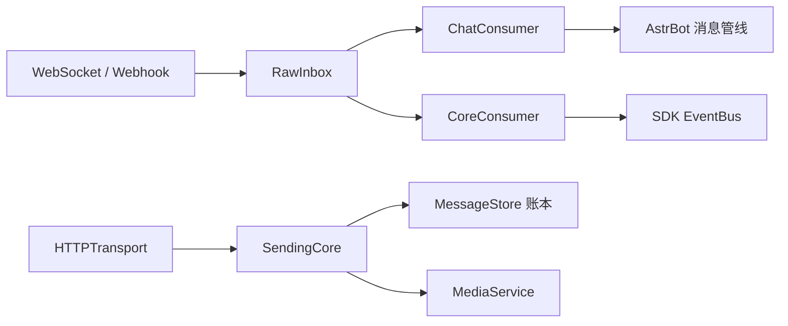

# 架构与数据流

## 总体结构

插件注册两个平台类型：`qq_official_v2`（WebSocket）和 `qq_official_v2_webhook`（Webhook）。两者共享实例生命周期、收件箱、消息转换、发送核心、资料服务和 SDK；只有传输层不同。

## 运行时组件

- `V2Adapter`：绑定一个平台配置和一个不可变 `InstanceKey`，负责启动、撤销、重载和关闭所有子服务。
- `HTTPTransport`：获取 QQ access token，执行官方 HTTPS 请求，处理 `Retry-After` 和有界退避。
- `GatewayGroup` / `Gateway`：负责网关发现、分片、Identify/Resume、心跳和断线恢复。
- `Webhook`：验证官方 Ed25519 签名和挑战请求，把已认证 body 写入收件箱。
- `RawInbox`：将原始信封持久化，独立记录接收、核心处理、宿主交付和留置状态。
- `ChatConsumer`：只处理六类真实聊天事件，执行转换、去重、资料观察、宿主排队和最终确认。
- `CoreConsumer`：处理 READY/RESUMED、互动、管理和 SDK 观察事件。
- `SendingCore`：统一 AstrBot 消息链、QQ JSON、回复来源、序号、主动/被动模式和防重账本。
- `MediaService`：读取受宿主解析器允许的本地输入，处理外链转存和官方分片上传。
- `EventBus`：给插件观察已进入核心的类型化事件，不改变 Intents、传输或宿主聊天投递。

## 处理顺序

1. 传输层接收并校验 QQ 信封。
2. 传输层先拒绝无法解析的信封；可接受的原始信封由 `RawInbox.accept()` 以 owner 和 receipt 持久化，后续处理失败才进入留置区，不假装已处理。
3. 聊天消费者将六类聊天事件转换为 `V2MessageEvent`；核心消费者处理非聊天通知、互动和 SDK 事件。
4. 宿主消息管线确认事件后，收件箱才会进入 delivered/tombstone 状态。
5. 发送结果、操作 ID、来源、序号和部分成功信息写入 `MessageStore`；未知结果保留，禁止自动重放。

HTTP 响应成功只代表 QQ 接受了某个请求阶段，不代表宿主已消费事件或所有业务副作用完成。处理进度应通过 receipt 或 operation ID 查询。

## 四种场景

`v2/models.py` 定义四种 route：`group`、`c2c`、`channel`、`dm`。route 同时包含机器人身份、场景和目标，频道/群事件还可能携带用户。所有 ID 必须是非空字符串；不要从 QQ 号推导 OpenID，也不要跨场景重用 route。

## 边界原则

- 观察者不提供业务重放；需要恢复时使用持久收件箱的 receipt，并遵守核心已确认的阶段。
- 旧实例的 client、route、reply source 和 upload handle 在重载/撤销后必须失效。
- 任何可重试的 HTTP 行为都必须经过共享操作账本；unknown 不能通过换一个 operation ID 来“确认式重试”。
- 发送一次消息前完成组合校验，无法表达的消息链应失败，而不是静默丢段或拆条。
