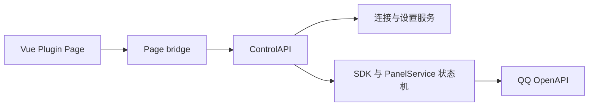

# Vue 控制页面与 SDK 集成

QQ V2 的控制页面是 AstrBot Plugin Page。页面负责展示状态、编辑非敏感草稿和发起经过确认的管理操作；QQ 网络请求、平台生命周期、权限检查和操作恢复由插件后端负责。Vue 页面不能直接导入 Python SDK，也不能从浏览器直接请求 QQ OpenAPI。

## 页面入口

正式入口是 `pages/control/index.html`。用户应从 AstrBot 的插件 Pages 打开它，页面通过 `window.AstrBotPluginPage` 获取宿主提供的 `ready()`、`apiGet()` 和 `apiPost()` 桥接方法。

`dash/` 保存 Vue 源码、Vite 配置和单文件构建入口。迁移期间可以把构建产物写入 `pages/test`，用于验证组件和接口；这不是正式页面入口。Vue 页面准备替换稳定控制台时，应把构建输出和页面元数据切换到 `pages/control`，删除旧入口中不再使用的脚本和样式，并同步更新 README、页面测试和 CI。如果迁移分支保留 `pages/debug`，它只适合本地调试，不应作为用户配置入口。

## 请求链路



ControlAPI 注册在插件命名空间下，当前页面使用这些请求组：

| 用途 | 请求 | 后端职责 |
| --- | --- | --- |
| 初始化 | `bootstrap` | 返回 CSRF、全局开关、实例列表和设置默认值，不返回凭据。 |
| 连接 | `connection`、`connection/save`、`connection/reload` | 读取和修改宿主平台配置；保存连接与重载实例分开。 |
| 扫码绑定 | `onboarding/start`、`onboarding/status`、`onboarding/cancel`、`onboarding/commit` | 管理短期扫码租约，提交凭据时执行身份和凭据确认。 |
| 本地菜单 | `config`、`commands`、`preview`、`config/mutate` | 读取设置草稿、命令目录和本地预览；`apply` 只改变本地运行设置。 |
| QQ 面板 | `panels/plan`、`panels/enable`、`panels/sync`、`panels/disable`、`panels/status` | 预览范围、确认托管、同步或停止同步指定的远端面板。 |
| 全局开关 | `flags` | 修改 WebUI、远端面板同步和旧 OneBot 网络入口的开关。 |
| 保留事件 | `inbox/retained`、`inbox/discard` | 查看元数据并在短期确认窗口内明确丢弃事件。 |

每个管理请求都必须由页面桥接对象发送。POST 请求携带 `csrf`；涉及写入的连接和平台请求携带 `platform_id` 与当前 `fingerprint`；菜单草稿和预览请求还携带 `revision` 与 `scene`。页面应在目标实例切换、请求失败或收到 `config_conflict` 后重新读取状态，不能继续使用旧实例的 revision、fingerprint 或扫码 ticket。

服务端先要求 Dashboard 管理员会话，再检查 `webui_enabled`。CSRF、实例指纹、草稿版本和平台代次分别防止跨站请求、写入错误实例、覆盖其他编辑者的草稿，以及操作已经重载或撤销的连接。前端确认框不能替代这些服务端检查。

## 当前配置契约

连接表单应跟随 `v2/connections.py` 的当前字段：

```text
appid, use_markdown, type, intents, shard_mode, shard, enable, onebot
```

`type` 表示 WebSocket 或 Webhook 平台类型，`shard_mode` 表示自动或手动分片。旧配置中的 `transport`、`environment` 和 `is_sandbox` 由服务端兼容处理，Vue 页面不应把它们作为当前表单字段发送。`onebot` 是迁移期的旧网络入口配置；它不代表 SDK 的调用方式。

菜单草稿由 `v2/settings.py` 校验，包含四层 `layout`、四个场景的 `panels`、`scene_overrides`、`node_overrides` 和当前 `extensions` 字段。页面不能自行加入 `media_roots` 或其他未经 schema 声明的字段。编辑嵌套对象时，删除字段应在 patch 中表达为 `null`，因为服务端对对象使用递归合并。

连接保存、菜单草稿保存和菜单应用是三个不同动作：

1. 保存连接只写入宿主平台配置，并使旧实例代次失效；它不会自动连接 QQ。
2. 保存草稿只写入设置版本；它不会发布 QQ 面板。
3. 应用草稿只更新本地运行设置；发布 QQ 面板还需要打开 `remote_menu_sync`，重新预览范围并明确确认。

页面切换实例或场景前，应检查连接表单和菜单草稿的 dirty 状态。加载新目标时先把响应写入临时对象，连接、配置和命令目录都成功后再替换页面状态。

## SDK 与统一操作调度

页面不直接调度 QQ 请求。ControlAPI 把操作交给当前服务：

- QQ 原生读取和写入以 `V2Client`、`NativeView` 以及 `v2/sdk/api/` 中的具名 API 为基础。
- 管理、菜单、媒体和按钮等需要确认结果的原生写操作使用 `ExtensionStore.execute` 的操作账本。账本绑定 `operation_id`、请求 binding、代次和诊断上下文，并记录 `not_sent`、`rejected`、`unknown`、`partial` 和 `succeeded` 等状态。
- `PanelService` 负责机器人级锁、目录稳定性、托管范围、pending 状态和远端漂移核对。启用托管必须经过 `plan`，发送前再次验证 plan fingerprint；未知结果只能核对远端状态，不能换一个 ID 自动重放。托管同步的网络写入需要在这个状态机内接入原生 SDK 和操作账本，页面不能自行实现第二套重试调度。
- 消息发送继续由 `SendingCore`、`MessageStore` 和 `DeliverySlots` 处理，因为消息还需要回复来源、序号、媒体、主动或被动发送策略以及宿主投递状态。

这些调度通道共享实例代次检查和操作结果语义，但不把消息投递、互动 ACK、管理写入和面板同步混成一条无差别队列。互动 ACK 使用独立的优先容量，普通原生写入使用操作账本，面板同步使用自己的机器人锁和恢复状态。这样可以避免普通配置或面板操作阻塞互动确认，也能保留消息回复的来源和序号约束。

Vue 组件应只调用 `api.js` 中的控制方法。组件不应：

- 构造 QQ OpenAPI URL、读取 AppSecret 或复用 OneBot token；
- 直接调用 `fetch`、`HTTPTransport`、`NativeView` 或 `instance.http`；
- 在 unknown、result_unknown 或 partial 后自动换新的 operation ID 重试；
- 用页面状态推断 QQ 已经发布成功；
- 把“停止同步”当作删除远端面板。

页面需要显示服务端返回的 `remote_state`、`extension_state.operations`、`pending` 和错误阶段，给用户“重新读取状态”的路径。网络超时或进程重启后，页面应先查询原操作和面板状态，再决定是否继续。

## OneBot 迁移期边界

`onebot_network_enabled` 和实例中的 `onebot` 配置只服务已有外部客户端。它们属于迁移期兼容入口，默认关闭，关闭全局开关会撤销正在运行的监听。控制页面的连接、菜单和面板功能不依赖这个网络入口。

新插件和新集成应使用：

```python
event.bot.qq
event.bot.qq.events
event.send(...)
```

需要明确场景和目标时，使用 `event.bot.qq.send(scene, target, message, operation_id=...)` 或 SDK 中对应的具名 API。旧网络客户端应按照[SDK 迁移指南](sdk-migration.md)逐项迁移，确认调用方不再依赖网络入口后，再关闭 `onebot_network_enabled` 并移除实例监听配置。

页面仍可以显示 OneBot 兼容入口的状态，因为迁移期间管理员需要知道监听是否启用、是否有独立 token 和是否需要重载。页面不能把 OneBot action 当作 SDK 功能清单，也不能为了兼容外部客户端而给 SDK 增加数字 QQ 号、跨场景 ID 或隐式权限。

## 本地开发和构建

在仓库根目录执行：

```bash
cd dash
npm ci
npm run dev
```

Vite 7 要求 Node `^20.19.0` 或 `>=22.12.0`；仓库 CI 使用 Node 24。`npm run dev` 只提供 Vue 热更新，真实的 `AstrBotPluginPage` bridge、Dashboard 管理员会话和 ControlAPI 仍需从 AstrBot Plugin Pages 打开页面。直接在普通浏览器打开 Vite 地址不能完成真实连接、扫码或 QQ 操作。

构建单文件页面：

```bash
npm run build
```

构建前确认 `dash/vite.config.js` 的 `build.outDir` 指向当前验证入口。迁移阶段通常输出到 `../pages/test`；准备替换正式控制台时应改为 `../pages/control`，并检查生成的 `index.html` 是否覆盖正确入口。构建完成后检查：

```bash
git diff -- pages/control pages/test
git status --short
```

发布构建必须提交与源码匹配的单文件产物，CI 应执行 `npm ci`、`npm run build`，并在无预期变更时用 `git diff --exit-code` 检查构建产物漂移。构建产物中不能出现 AppSecret、网络 token 或调试假数据。

页面行为验收至少覆盖：

- 首次打开、已有实例、新建目标和不存在目标的错误状态；
- 连接字段 patch、AppID 改绑确认、扫码租约取消和重载分离；
- 实例或场景切换时的 dirty guard、revision 冲突和旧状态清理；
- 菜单递归 patch、四层布局预览、保存与本地应用的分离；
- 远端面板 plan fingerprint、全局开关确认、pending/unknown/reconcile；
- 重复 operation ID、代次失效、服务端超时和进程重启后的状态查询。

Python 回归测试仍按仓库的隔离运行器执行：

```bash
ASTRBOT_SOURCE="$PWD/.host-source" \
PYTHON_ENV="$PWD/.host-source/.venv" \
bash scripts/test-isolated.sh -q
```

前端构建和页面测试都通过后，才可以把 Vue 页面从 `pages/test` 迁移为 `pages/control` 的稳定入口。
